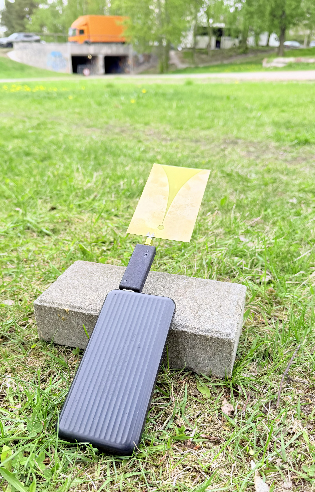
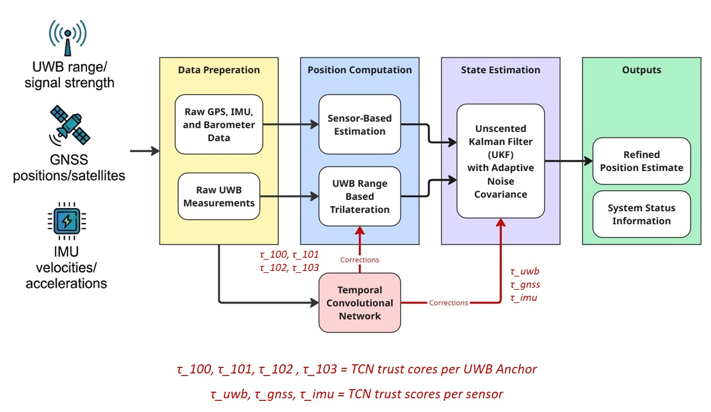
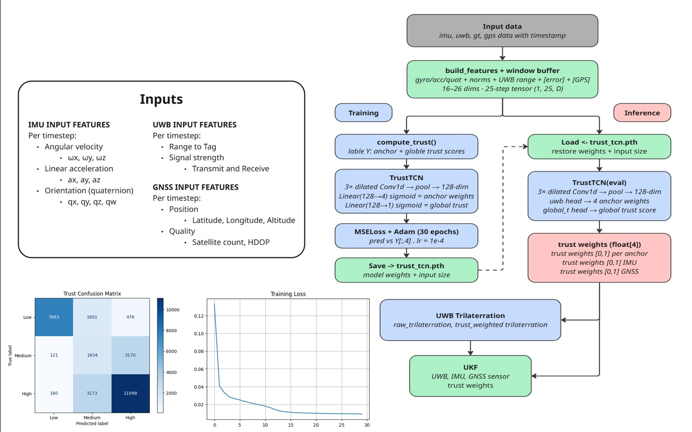
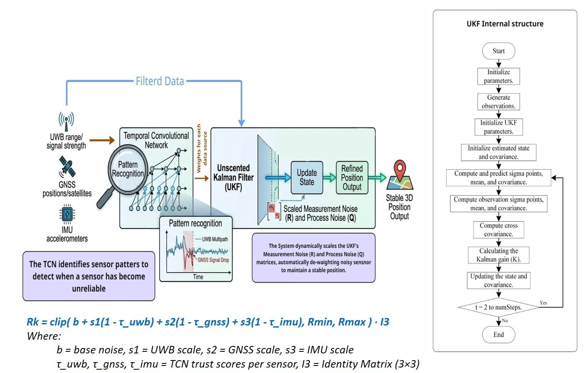
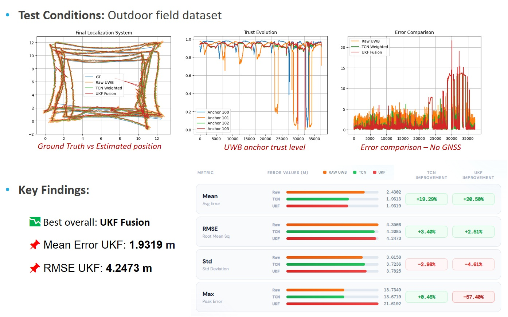
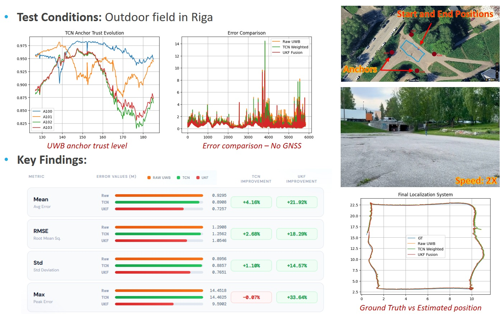

# UWB-Localization
> **Real-Time 3D Outdoor Localization Using UWB, GNSS, and IMU Fusion with Deep Learning**

## 📌 Goal of Research
The objective of this thesis is to design, implement, and evaluate a real-time three-dimensional outdoor localization system that combines Ultra-Wideband (UWB), Global Navigation Satellite System (GNSS), and Inertial Measurement Unit (IMU) data using a deep learning-based fusion architecture. The goal is to achieve high positioning accuracy compared to classical filter-based methods in dynamic outdoor settings.

## 🎯 Objectives
* **Sensor Fusion:** Develop a real-time 3D outdoor localization system by fusing GNSS, UWB, and IMU data.
* **Error Mitigation:** Mitigate single-sensor limitations, including GNSS signal degradation, UWB range constraints, and IMU drift.
* **Deep Learning Integration:** Implement a Temporal Convolutional Network (TCN) to enhance Unscented Kalman Filter (UKF)-based sensor fusion and improve position estimation accuracy.
* **Performance Evaluation:** Evaluate system performance in challenging outdoor environments, including GPS-denied and multipath conditions.

---

## 🛠️ Installation and Setup

### 1. Install ROS Noetic
Follow the official guide for Ubuntu system: [ROS Noetic Installation for Ubuntu](https://wiki.ros.org/noetic/Installation/Ubuntu)

### 2. Create and Build Catkin Workspace
Open  terminal and run the following commands to set up your workspace:

```bash
# Create the workspace directory
mkdir -p ~/catkin_ws/src
cd ~/catkin_ws/

# Initialize and build the workspace
catkin_make

# Source the workspace environment
source devel/setup.bash

```

### 3. Install mavros

Follow the official guide for Ubuntu system: [ROS Noetic - mavros](https://wiki.ros.org/mavros)

Install GeographicLib datasets by running the install_geographiclib_datasets.sh script:

```bash
wget https://raw.githubusercontent.com/mavlink/mavros/master/mavros/scripts/install_geographiclib_datasets.sh
./install_geographiclib_datasets.sh

```
## Hardware

### 1. Mobile TAG unit with onboard processing
<p align="center">
  
</p>

### 2. Fixed Anchor 
<p align="center">
  
</p>

## Methodology


## Temporal Convolutional Network Module


## Hybrid UKF-TCN Architecture


## Experimental Results 


## Experimental Results - Riga


Test setup: [Real world test in Riga, Latvia](https://drive.google.com/file/d/1_wP7MhZwfbHMjNLN4W4QR421jS1OajCn/view?usp=drive_link)